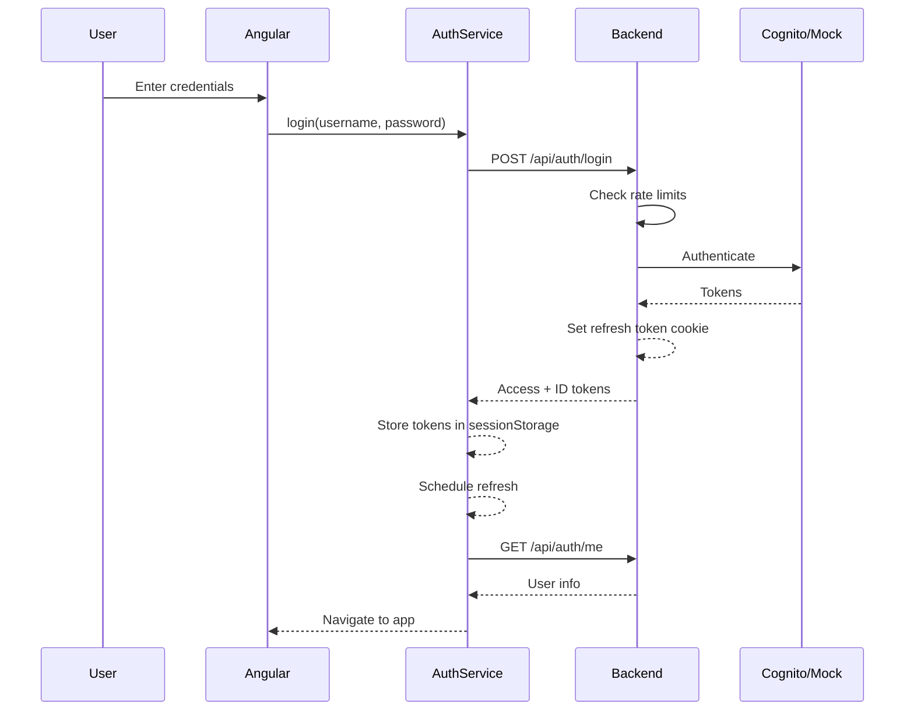
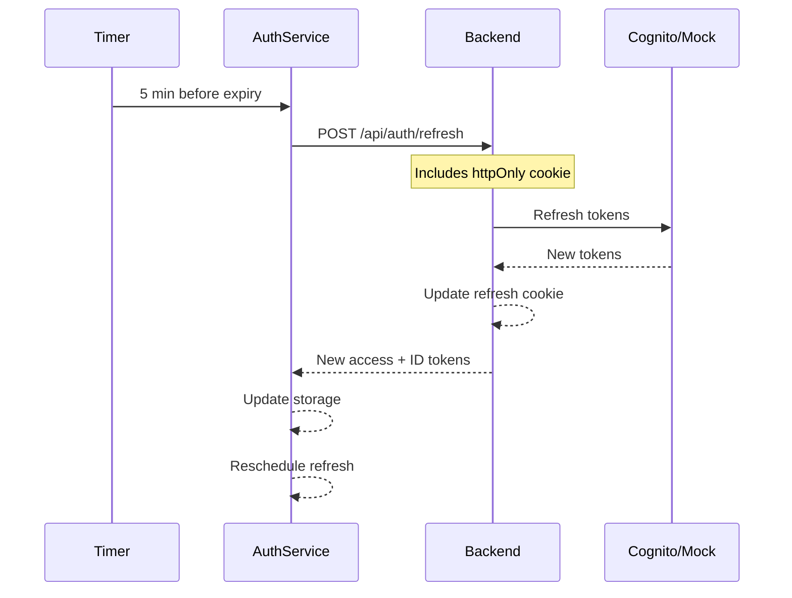

# Well Versed Authentication Architecture

## Table of Contents
1. [Overview](#overview)
2. [Authentication Flow](#authentication-flow)
3. [Components](#components)
4. [Token Management](#token-management)
5. [Security Features](#security-features)
6. [Environment Modes](#environment-modes)
7. [Testing](#testing)

## Overview

The Well Versed application uses a modern, secure authentication system with support for both local development and production AWS Cognito environments. The system implements JWT-based authentication with refresh tokens, rate limiting, audit logging, and token blacklisting.

### Key Features
- **Dual-mode authentication**: Local mock auth for development, AWS Cognito for production
- **Secure token storage**: Hybrid approach with httpOnly cookies for refresh tokens
- **Automatic token refresh**: Tokens refresh 5 minutes before expiry
- **Rate limiting**: Protection against brute force attacks
- **Audit logging**: Comprehensive security event tracking
- **Token blacklisting**: Support for immediate token revocation
- **Group-based authorization**: Role-based access control

## Authentication Flow

### 1. Login Flow



### 2. Token Refresh Flow



## Components

### Frontend Components

#### 1. AuthService (`auth.service.ts`)
- **Purpose**: Core authentication logic
- **Responsibilities**:
  - Login/logout functionality
  - Token storage and management
  - Automatic token refresh
  - User state management
  - Group membership checking

**Key Methods**:
```typescript
login(username: string, password: string): Observable<User>
logout(): Observable<void>
refreshToken(): Observable<AuthTokens>
isAuthenticated(): boolean
hasAnyGroup(groups: string[]): boolean
```

#### 2. AuthGuard (`auth.guard.ts`)
- **Purpose**: Route protection
- **Features**:
  - Checks authentication status
  - Validates group permissions
  - Redirects to login with return URL
  - Works with lazy-loaded modules

**Usage**:
```typescript
{
  path: 'admin',
  canActivate: [AuthGuard],
  data: { groups: ['admin', 'moderator'] },
  component: AdminComponent
}
```

#### 3. AuthInterceptor (`auth.interceptor.ts`)
- **Purpose**: Automatic token injection
- **Features**:
  - Adds Bearer token to API requests
  - Handles 401 responses
  - Triggers token refresh
  - Excludes auth endpoints

### Backend Components

#### 1. CognitoService (`cognito_service.py`)
- **Purpose**: AWS Cognito integration
- **Modes**:
  - **Local**: Mock authentication with JWT generation
  - **Production**: Full AWS Cognito integration

**Key Methods**:
```python
initiate_auth(username, password) -> Dict
verify_token(access_token) -> Optional[UserInfo]
refresh_auth(refresh_token) -> Dict
revoke_token(refresh_token) -> None
```

#### 2. AuthMiddleware (`auth_middleware.py`)
- **Purpose**: Request authentication
- **Features**:
  - JWT validation
  - Token blacklist checking
  - Group-based authorization
  - User context injection

**Usage**:
```python
@router.get("/protected")
async def protected_route(user: UserInfo = Depends(require_auth)):
    return {"user": user.email}
```

#### 3. Auth Routes (`auth_routes.py`)
- **Endpoints**:
  - `POST /auth/login` - User authentication
  - `POST /auth/refresh` - Token refresh
  - `POST /auth/logout` - User logout
  - `GET /auth/me` - Current user info
  - `GET /auth/health` - Auth system health

#### 4. Rate Limiter (`rate_limit.py`)
- **Purpose**: Brute force protection
- **Features**:
  - IP-based rate limiting
  - User-based rate limiting
  - Progressive delays
  - Redis-backed in production

#### 5. Token Blacklist (`token_blacklist.py`)
- **Purpose**: Token revocation
- **Features**:
  - Immediate token invalidation
  - TTL-based expiration
  - Redis-backed storage
  - Support for all token types

## Token Management

### Token Types

1. **Access Token**
   - **Storage**: sessionStorage
   - **Lifetime**: 1 hour
   - **Usage**: API authentication
   - **Contains**: User ID, email, groups

2. **ID Token**
   - **Storage**: sessionStorage
   - **Lifetime**: 1 hour
   - **Usage**: User identity
   - **Contains**: User profile data

3. **Refresh Token**
   - **Storage**: httpOnly cookie
   - **Lifetime**: 30 days
   - **Usage**: Token renewal
   - **Security**: Cannot be accessed by JavaScript

### Token Storage Strategy

```javascript
// Frontend storage approach
{
  "sessionStorage": {
    "auth_tokens": {
      "access_token": "eyJ...",
      "id_token": "eyJ...",
      "expires_at": 1234567890,
      "token_type": "Bearer"
    },
    "current_user": {
      "user_id": "123",
      "email": "user@example.com",
      "groups": ["user"]
    }
  },
  "cookies": {
    "refresh_token": {
      "value": "encrypted_token",
      "httpOnly": true,
      "secure": true,
      "sameSite": "strict"
    }
  }
}
```

## Security Features

### 1. Password Requirements
- Minimum 8 characters
- Must contain uppercase, lowercase, number, and special character
- No common passwords
- Password history checking (production)

### 2. Rate Limiting
```python
# Configuration
LOGIN_ATTEMPTS = 5           # Max attempts
LOGIN_WINDOW = 900           # 15 minutes
PROGRESSIVE_DELAY = True     # Increasing delays
```

### 3. CORS Configuration
```python
# Environment-specific CORS
LOCAL: ["http://localhost:4200", "http://localhost:3000"]
PRODUCTION: ["https://wellversed.io", "https://www.wellversed.io"]
```

### 4. Audit Logging
```python
# Logged events
- LOGIN_SUCCESS
- LOGIN_FAILURE
- LOGOUT
- TOKEN_REFRESH
- TOKEN_REVOKE
- PASSWORD_CHANGE
- PERMISSION_DENIED
```

### 5. Token Security
- Short-lived access tokens (1 hour)
- Secure refresh token storage (httpOnly cookies)
- Automatic refresh before expiry
- Token blacklisting support
- JWKS key rotation (production)

## Environment Modes

### Local Development Mode

```bash
# Environment variables (.env)
ENVIRONMENT=local
LOCAL_JWT_SECRET=<32+ character secret>
LOCAL_TEST_USERS=test@example.com,admin@example.com
LOCAL_TEST_PASSWORD=<secure_password>
```

**Features**:
- Mock authentication (any valid email/password works)
- Local JWT generation
- In-memory token blacklist
- Simplified rate limiting
- No external dependencies

### Production Mode

```bash
# Environment variables
ENVIRONMENT=production
AWS_REGION=us-east-1
COGNITO_USER_POOL_ID=us-east-1_xxxxxxxxx
COGNITO_CLIENT_ID=xxxxxxxxxxxxxxxxxxxxxxxxxx
COGNITO_CLIENT_SECRET=<backend_only_secret>
COGNITO_DOMAIN=https://your-domain.auth.us-east-1.amazoncognito.com
```

**Features**:
- Full AWS Cognito integration
- MFA support
- Password policies
- User groups and permissions
- SAML/OAuth federation
- Redis-backed rate limiting
- Distributed token blacklist

## Testing

### 1. Manual Testing

```bash
# Test authentication flow
./scripts/test_auth_flow.sh

# Test backend health
./scripts/test_backend_health.sh

# Test with environment password
export LOCAL_TEST_PASSWORD="YourSecurePassword123!"
curl -X POST http://localhost:8000/api/auth/login \
  -H "Content-Type: application/json" \
  -d "{\"username\":\"test@example.com\",\"password\":\"${LOCAL_TEST_PASSWORD}\"}"
```

### 2. Browser Testing

1. Navigate to http://localhost:4200
2. You'll be redirected to /login
3. Enter test credentials:
   - Email: test@example.com
   - Password: (from LOCAL_TEST_PASSWORD env var)
4. Click "Sign In" or "Use test account"
5. Verify navigation to main app
6. Check user menu shows email
7. Test logout functionality

### 3. Token Refresh Testing

```javascript
// In browser console
// Wait for automatic refresh (55 minutes)
// Or manually trigger:
localStorage.setItem('auth_tokens', JSON.stringify({
  ...JSON.parse(localStorage.getItem('auth_tokens')),
  expires_at: Date.now() / 1000 + 240 // 4 minutes
}));
// Should see refresh happen within 30 seconds
```

### 4. Rate Limiting Testing

```bash
# Test rate limiting
for i in {1..10}; do
  curl -X POST http://localhost:8000/api/auth/login \
    -H "Content-Type: application/json" \
    -d '{"username":"test@example.com","password":"wrong"}' \
    -w "\n"
done
# Should see rate limit errors after 5 attempts
```

## Troubleshooting

### Common Issues

1. **"LOCAL_TEST_PASSWORD environment variable not set"**
   - Add `LOCAL_TEST_PASSWORD=YourPassword123!` to .env file
   - Source the environment: `source .env`

2. **"Invalid or expired token"**
   - Clear browser storage: `sessionStorage.clear()`
   - Clear cookies and retry login

3. **"Token has been revoked"**
   - Token was blacklisted after logout
   - Login again to get new tokens

4. **CORS errors**
   - Check FRONTEND_URL in backend .env
   - Verify ALLOWED_ORIGINS for production

5. **Cookie not being set**
   - Check secure flag matches HTTPS usage
   - Verify SameSite settings
   - Check browser cookie settings

### Debug Mode

```typescript
// Enable auth debug logging
localStorage.setItem('auth_debug', 'true');

// View stored tokens
console.log('Tokens:', JSON.parse(sessionStorage.getItem('auth_tokens')));
console.log('User:', JSON.parse(sessionStorage.getItem('current_user')));

// Check cookie
document.cookie.split(';').find(c => c.includes('refresh_token'));
```

## Best Practices

1. **Never expose sensitive tokens in logs**
2. **Always use HTTPS in production**
3. **Rotate JWT secrets regularly**
4. **Monitor failed login attempts**
5. **Implement proper session timeout**
6. **Use CSP headers to prevent XSS**
7. **Keep refresh tokens in httpOnly cookies**
8. **Implement token refresh before expiry**
9. **Use rate limiting on all auth endpoints**
10. **Maintain comprehensive audit logs**

## Migration Guide

### From Session-Based to JWT

1. Update backend to issue JWTs
2. Modify frontend to store tokens
3. Add auth interceptor
4. Update API calls to include Bearer token
5. Implement refresh mechanism
6. Add logout token blacklisting

### From Local to Production

1. Set up AWS Cognito User Pool
2. Configure app client settings
3. Update environment variables
4. Deploy with production config
5. Test MFA and password policies
6. Monitor CloudWatch logs

## API Reference

### Authentication Endpoints

#### POST /api/auth/login
```json
Request:
{
  "username": "user@example.com",
  "password": "SecurePassword123!"
}

Response:
{
  "access_token": "eyJ...",
  "id_token": "eyJ...",
  "refresh_token": "...",
  "expires_in": 3600,
  "token_type": "Bearer"
}
```

#### POST /api/auth/refresh
```json
Request: (refresh_token in cookie)

Response:
{
  "access_token": "eyJ...",
  "id_token": "eyJ...",
  "expires_in": 3600,
  "token_type": "Bearer"
}
```

#### POST /api/auth/logout
```json
Request:
Headers: {
  "Authorization": "Bearer eyJ..."
}

Response:
{
  "message": "Successfully logged out"
}
```

#### GET /api/auth/me
```json
Request:
Headers: {
  "Authorization": "Bearer eyJ..."
}

Response:
{
  "user_id": "123",
  "email": "user@example.com",
  "email_verified": true,
  "username": "user",
  "groups": ["user", "premium"]
}
```

## Architecture Decisions

### Why Hybrid Token Storage?

**Problem**: Where to securely store tokens in a browser environment?

**Options Considered**:
1. localStorage - Vulnerable to XSS
2. sessionStorage - Vulnerable to XSS but cleared on tab close
3. Cookies - Vulnerable to CSRF
4. httpOnly Cookies - Not accessible to JavaScript

**Solution**: Hybrid approach
- Access tokens in sessionStorage (needed by JavaScript, short-lived)
- Refresh tokens in httpOnly cookies (sensitive, long-lived)

### Why Separate Auth Service?

**Benefits**:
1. Centralized auth logic
2. Easier testing
3. Framework agnostic
4. Consistent token handling
5. Single source of truth for auth state

### Why Token Blacklisting?

**Use Cases**:
1. Immediate logout across devices
2. Compromised token revocation
3. Permission changes
4. Security incidents

**Implementation**: Redis with TTL matching token expiry

## Future Enhancements

1. **Biometric Authentication**: WebAuthn support
2. **Social Login**: Google, Facebook, GitHub OAuth
3. **Session Management**: View/revoke active sessions
4. **Device Trust**: Remember trusted devices
5. **Passwordless**: Magic link authentication
6. **Risk-Based Auth**: Adaptive authentication based on context
7. **Token Binding**: Bind tokens to TLS connection
8. **Mutual TLS**: Certificate-based authentication